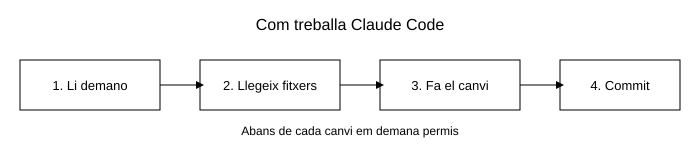

# Fitxa tècnica: guia de com funciona Claude Code

Marc Bruguera Toro - SMX2 Grup A

Data: 05/10/2026

## Objectiu

Explicar com s'instal·la i com funciona **Claude Code**, que és un assistent d'intel·ligència
artificial que es fa servir des del terminal.

La diferència amb un xat normal és que Claude Code pot veure els fitxers de la carpeta on el
tens obert, els pot modificar i també pot executar ordres. Sempre et demana permís abans de
fer un canvi.



## Materials

- Un ordinador amb Windows 11.
- Node.js (versió 18 o més nova).
- Git.
- Visual Studio Code.
- Un compte de Claude per poder iniciar sessió.
- Connexió a internet.

## Procediment

1. Obrir el terminal PowerShell i comprovar que tenim Node.js instal·lat:

```
node --version
```

2. Instal·lar Claude Code amb npm:

```
npm install -g @anthropic-ai/claude-code
```

3. Comprovar que s'ha instal·lat bé:

```
claude --version
```

4. Anar a la carpeta del projecte amb l'ordre `cd`:

```
cd "C:\Users\marcb\Desktop\primer repositori\primer_repositori"
```

5. Engegar el programa escrivint `claude`. El primer cop s'obre el navegador per iniciar sessió.

```
claude
```

6. Provar l'ordre `/help` per veure totes les ordres que es poden fer servir. Les ordres que
comencen amb una barra les fa el programa, no l'IA.

7. Escriure la primera petició en català o castellà, per exemple "afegeix una secció al
README.md". Ell busca el fitxer, fa la proposta i espera que diguis que sí.

8. Fer servir l'ordre `/init` per crear el fitxer CLAUDE.md. En aquest fitxer es guarda la
informació del projecte i així no li has de tornar a explicar cada dia.

9. Si les respostes es tornen repetitives, escriure `/clear` per buidar la conversa i començar
de nou.

10. Si el fas servir dins del terminal de Visual Studio Code, els canvis es veuen pintats a
l'editor.

## Comprovacions

- [ ] L'ordre `node --version` em dóna la versió 18 o més.
- [ ] L'ordre `claude --version` em dóna un número de versió.
- [ ] Quan engego `claude` surt la carpeta correcta del projecte.
- [ ] No em torna a demanar iniciar sessió cada vegada.
- [ ] L'ordre `/help` em mostra la llista d'ordres.
- [ ] Em demana permís abans de canviar un fitxer.
- [ ] L'ordre `/clear` buida la conversa.

## Incidències i solucions

| Incidència                                       | Solució                                                                                            |
| ------------------------------------------------ | -------------------------------------------------------------------------------------------------- |
| Surt l'error "claude no es reconeix com a ordre" | Tancar el terminal i tornar-lo a obrir. Si segueix igual, afegir la carpeta de npm al PATH.        |
| La instal·lació falla per permisos               | Obrir el PowerShell com a administrador i tornar-ho a provar.                                      |
| No s'obre el navegador per iniciar sessió        | Copiar l'enllaç que surt al terminal i enganxar-lo al navegador.                                   |
| No troba els fitxers del projecte                | Has engegat el programa des d'una altra carpeta. Sortir, fer `cd` a la carpeta bona i tornar-hi.   |
| Ha fet un canvi que no volia                     | Recuperar el fitxer com estava amb `git restore fitxa-tecnica.md`.                                 |
| Les respostes es tornen rares o repetitives      | Escriure `/clear` per buidar la conversa i tornar a començar.                                       |

## Flux de treball amb Git

Com que Claude Code pot modificar fitxers, és important revisar sempre els canvis amb Git
abans de guardar-los. El flux que faig servir és aquest:

```
git status
git diff
git add fitxa-tecnica.md
git commit -m "Afegeix fitxa tècnica"
git log --oneline
```

Què fa cada ordre:

- `git status` em diu quins fitxers han canviat i quins estan preparats per al commit.
- `git diff` em mostra línia per línia què s'ha modificat, així puc comprovar que el canvi és
  el que jo esperava.
- `git add` posa el fitxer a la zona de preparació (l'*staging*).
- `git commit -m "..."` guarda el canvi a l'historial amb un missatge que explica què s'ha fet.
- `git log --oneline` em mostra la llista de commits per veure l'historial.

Val més fer commits petits i sovint que un de molt gran al final, perquè així es veu millor
què s'ha anat canviant. Quan ja ho tinc tot guardat, pujo els canvis a GitHub:

```
git push origin main
```

## Recursos

- [Documentació de Claude Code](https://docs.claude.com/en/docs/claude-code/overview)
- [Pàgina per descarregar Node.js](https://nodejs.org/)
- [Documentació de Git](https://git-scm.com/doc)
- [Documentació consultada](https://docs.github.com/)
